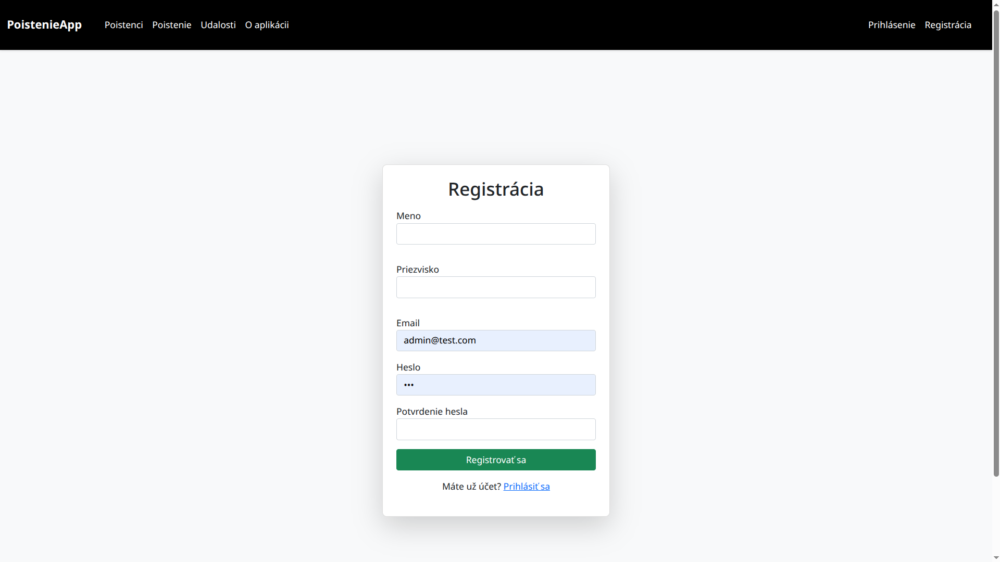
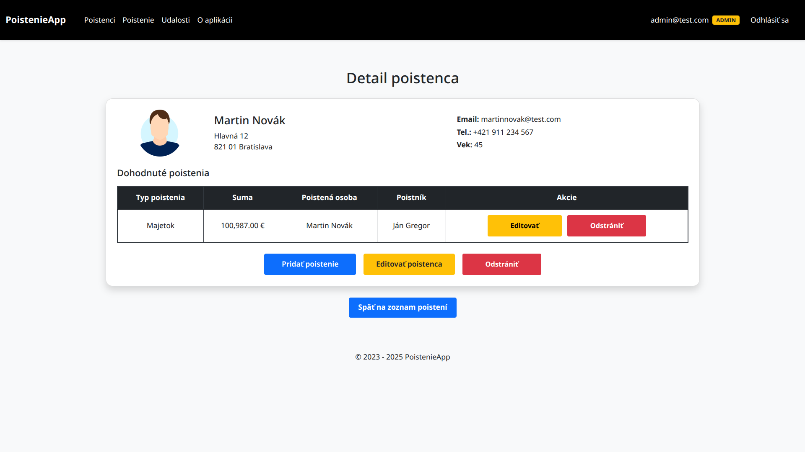
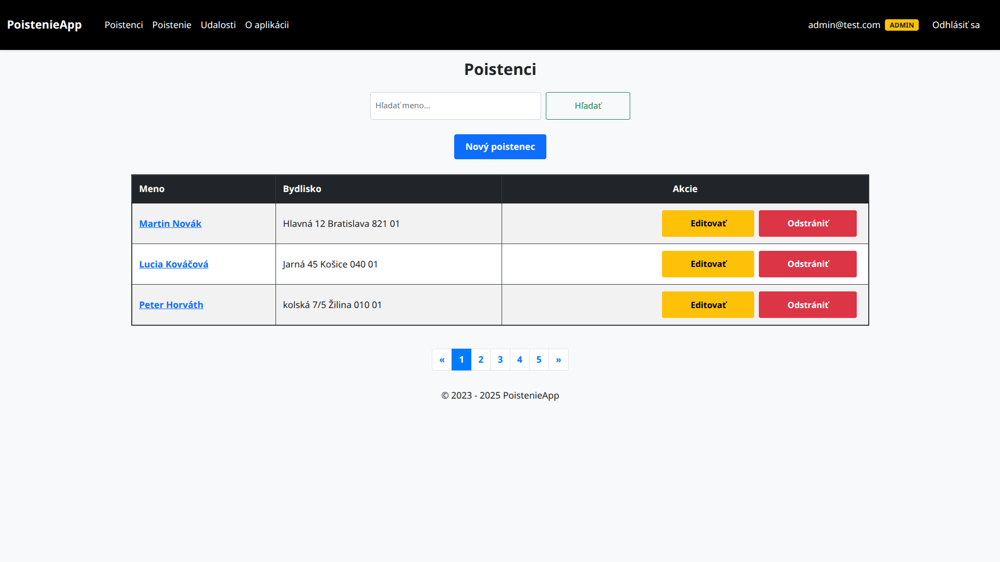
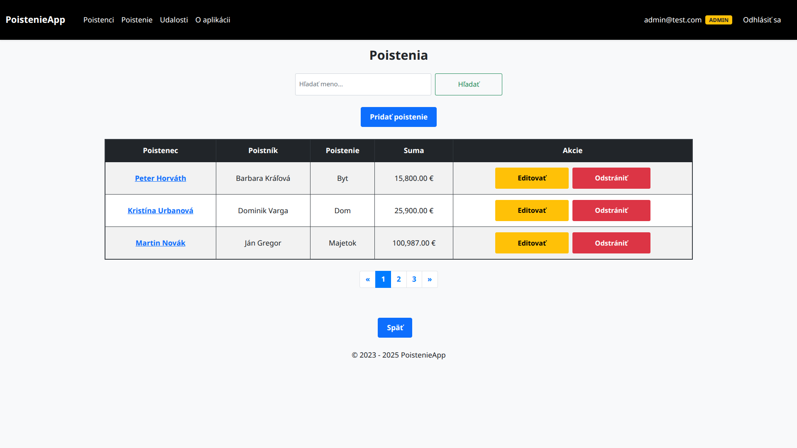
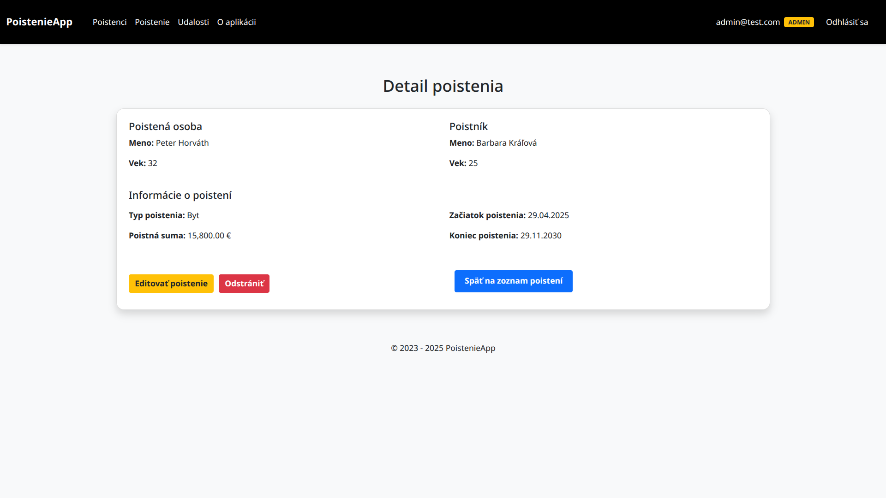

# 🛡️ InsuranceApp

A simple web application for managing insurance records, built with **Java**, **Spring Boot**, **Thymeleaf**, and **Bootstrap**.

---

## 🚀 How to Run the Project

### 1️⃣ Start the Database via Docker

The MySQL database runs on port **8081**. To start it, run:

```bash
docker-compose up -d
```

> ✅ Make sure Docker is installed and running.

The database is initialized automatically (check `docker-compose.yml` for details).

---

### 2️⃣ Run the Application in IntelliJ IDEA

1. Open the project in **IntelliJ IDEA**.
2. Run the main class: `PoistenieAppApplication.java`.
3. Access the app at:

```
http://localhost:8080
```

---

## 👥 User Roles and Registration

- 👤 **Admin** can manage all insured users.
- 📝 **New users** can register through the registration form.
- 🔒 Regular users can only view/edit their own profile.

---

## 🔐 Test Login Credentials

| Role              | Email                        | Password |
|-------------------|------------------------------|----------|
| **Admin**         | `admin@test.com`             | `123`    |
| **Regular User**  | `user@test.com`              | `123`    |
| **Admin-created** | `martinnovak@test.com`       | `123`    |
|                   | `luciakovacova@test.com`     | `123`    |

> ℹ️ Passwords are temporarily reduced to 3 characters for testing.

---

## 🖼️ Screenshots

<p float="left">
  
  
  
</p>

<p float="left">
  
  
  
</p>

<p float="left">
  
</p>

> 📂 All screenshots are stored in the `screenshots/` folder.

---

## 🛠️ Technologies Used

- Java 17+
- Spring Boot & Spring Security
- Thymeleaf
- Bootstrap 5
- MySQL (via Docker)
- Maven

---

## 📄 License

This project is licensed under the MIT License.

---

# 🛡️ PoistenieApp

Jednoduchá webová aplikácia na správu poistenia, vytvorená pomocou **Java**, **Spring Boot**, **Thymeleaf** a **Bootstrapu**.

---

## 🚀 Ako spustiť projekt

### 1️⃣ Spustenie databázy cez Docker

MySQL databáza beží na porte **8081**. Spustenie:

```bash
docker-compose up -d
```

> ✅ Vyžaduje nainštalovaný a spustený Docker.

Databáza sa inicializuje automaticky (viď `docker-compose.yml`).

---

### 2️⃣ Spustenie aplikácie v IntelliJ IDEA

1. Otvor projekt v **IntelliJ IDEA**.
2. Spusť hlavnú Spring Boot triedu: `PoistenieAppApplication.java`.
3. Aplikácia beží na adrese:

```
http://localhost:8080
```

---

## 👥 Používateľské roly a registrácia

- 👤 **Admin** môže spravovať všetkých poistencov.
- 📝 **Nový používateľ** sa môže zaregistrovať cez registračný formulár.
- 🔒 Bežný používateľ má prístup iba k svojmu profilu.

---

## 🔐 Prihlasovacie údaje na testovanie

| Rola               | Email                        | Heslo |
|--------------------|------------------------------|--------|
| **Admin**          | `admin@test.com`             | `123`  |
| **Používateľ**     | `user@test.com`              | `123`  |
| **Vytvorení adminom** | `martinnovak@test.com`    | `123`  |
|                    | `luciakovacova@test.com`     | `123`  |

> ℹ️ Heslá sú dočasne skrátené kvôli jednoduchému testovaniu.

---

## 🖼️ Ukážky obrazoviek

<p float="left">
  
  
  
</p>

<p float="left">
  
  
  
</p>

<p float="left">
  
</p>

> 📂 Všetky screenshoty sú uložené v priečinku `screenshots/`.

---

## 🛠️ Použité technológie

- Java 17+
- Spring Boot & Spring Security
- Thymeleaf
- Bootstrap 5
- MySQL (cez Docker)
- Maven

---

## 📄 Licencia

Tento projekt je licencovaný pod MIT licenciou.

-----------------------------------------------
